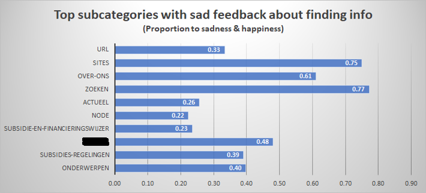

## Customer website feedback analysis

This challenge is about detecting root causes of customer dissatisfaction related to website services/information.
Our used dataset is a survey data gathered from customer feedback and our approach is finding the most important features contributing to the customer dissatisfaction.  
Firstly, the most important features are extracted by RandomForest algorithm. Then, we prioritize subcategories of web pages with most sad feedback considering the extracted important features in previous step. By doing so, further business steps are clear to act upon.  
For example, founding information is the most factor that customers were sad about. In detail, we prioritized which subcategories in webpages have the highest rank. As you can see, "zoeken" and "sites" are the first ones the business needs to improve.

